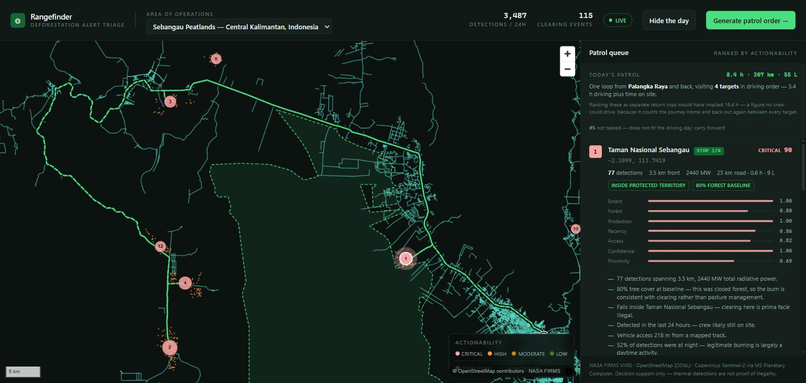
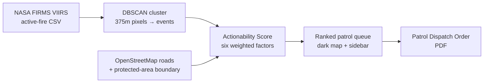

# Rangefinder

Deforestation alerting is a solved problem. Deciding which alert to drive to first is not — Rangefinder turns a firehose of satellite fire detections into a short, ranked, printable patrol order.



**Live demo: [https://rangefinder-cyan.vercel.app](https://rangefinder-cyan.vercel.app)**

Built for **Hack the Habitat** (theme: tech that protects the planet's ecosystems, climate and wildlife).

## The problem

A protected-area office does not lack data. It receives thousands of near-real-time satellite detections a week and can field one or two patrols a day. Today that choice gets made by eyeballing a heatmap — whichever cluster of dots looks biggest and closest wins the crew's time.

That method fails in a specific, predictable way: most alerts are unreachable, days old, too small to be worth the fuel, or sitting on land where the fire is perfectly legal. And the heatmap treats a 100-detection burn on unclassified frontier the same as a 2-detection burn inside a legally protected indigenous territory — visually, the second one barely registers. It should be the first phone call.

Rangefinder does not add more data. It ranks the data that already exists into something a ranger can act on and defend afterwards.

## Validation: are these fires actually on forest?

NASA FIRMS detects **heat**, not forest loss. During the Amazon burning season most fires
are on land that was already cleared — pasture maintenance, crop residue, re-burns — which
are routine and usually legal. A fire-based deforestation tool therefore owes you evidence
that its targets are on forest at all, rather than confidently ranking farm burns.

We checked. `scripts/validate_landcover.py` samples ESA WorldCover 10m (2021) in a ~1.1 km
box around every ranked target:

| | |
|---|---|
| Targets on ≥50% tree cover in 2021 | **10 of 10** |
| Mean tree cover across the top 10 | **91.7%** |
| Lowest individual target | 56.6% |

WorldCover predates these fires by five years, which is precisely the baseline that matters:
land already classified as cropland or grassland in 2021 cannot be undergoing deforestation
in 2026. Every current target sits on what was closed-canopy forest. The dense road grid
visible on the western side of the map is a **frontier pushing into forest**, not
established agriculture.

Reproduce it with `python scripts/validate_landcover.py`; the recorded run is in
`docs/landcover-validation.txt`.

**What this does and does not establish.** It shows the targets are on land that was forest
in 2021, which rules out the largest confound. It does not by itself prove clearing is
happening *now* — the land could in principle have been cleared between 2021 and 2025 and
be re-burning — and it does not distinguish a deforestation fire from an understory fire.
Closing those gaps means adding true canopy-loss alerts (GLAD/RADD), which is the top item
on the roadmap below.


## How it works



1. **Fetch** — `lib/sources/firms.ts` pulls the live NASA FIRMS VIIRS NOAA-20 bulk regional CSV (no API key required) and clips it to the demo Area of Interest.
2. **Cluster** — `lib/cluster.ts` runs DBSCAN (1,500 m radius) over the raw detections. VIIRS reports one row per 375 m pixel, so a single clearing produces dozens of rows; clustering first is what turns a pixel dump into a list of distinct clearing *events*.
3. **Score** — `lib/score.ts` scores every event against roads and protected-area geometry and produces an explicit, inspectable **Actionability Score** (see below).
4. **Render** — the ranked queue drives a dark MapLibre GL map and a sidebar list (`app/page.tsx`, `components/MapView.tsx`), each entry showing its score breakdown and a plain-English rationale.
5. **Dispatch** — `/api/patrol-order` renders a real PDF (`lib/pdf/PatrolOrder.tsx`, `@react-pdf/renderer`) for the top-ranked targets: GPS in decimal and DMS, road-access and drive-time estimates, per-target justification, and field checkboxes to sign off on return.

If the live FIRMS fetch fails or returns nothing for the AOI, the app falls back to a cached snapshot and says so — the interface never silently shows stale data as current.

## The Actionability Score

Every factor is normalised to 0–1 and combined as a **weighted geometric mean**, not a weighted average. That choice matters: with a geometric mean, one disqualifying factor (a target no vehicle can reach) correctly collapses the score instead of being averaged away by the others. Each factor is floored just above zero so one missing input can't annihilate an otherwise urgent target outright.

It is deliberately not a machine-learning model — there is no labelled dataset of "patrols that were worth sending," so a learned model here would be unfalsifiable dressing. A ranger can argue with six numbers; that matters more than a decimal place of accuracy.

| Factor | Weight | What it measures |
|---|---|---|
| **Extent** | 0.28 | How much forest is actually coming down. A blend of detection count (saturating at 30 detections/24h — beyond that the decision to go is unambiguous) and total fire radiative power, which breaks ties between equal-count clusters. |
| **Protection** | 0.22 | Whether the event falls inside a legally protected area, tested by ray-casting the coordinate against the real OpenStreetMap boundary polygon (not a distance approximation — see below). Inside scores 1.0; outside scores 0.35, not zero, because unclassified land still warrants a look. |
| **Recency** | 0.20 | Can the crew still be caught on site. Detections decay on a two-day half-life; past ~72 hours the visit becomes evidence collection rather than interdiction. |
| **Access** | 0.15 | Can a vehicle physically get there. Falls off hyperbolically with distance to the nearest mapped road — on a track scores 1.0, 1 km off scores 0.5, 5 km off scores 0.17 — with a 0.05 floor so remote mega-clearings still surface for an overflight rather than vanishing from the list. |
| **Confidence** | 0.10 | How much the detection itself is trusted — VIIRS's own low/nominal/high confidence flag. |
| **Proximity** | 0.05 | Fuel and hours from the ranger post. Deliberately the smallest weight: a small, close fire and a large, far one should not be conflated just because one is cheaper to reach. |

The weights and rationale live in `lib/score.ts`, alongside a rough one-way travel-time estimate (road speed for the driveable leg, walking pace for the final off-road approach) that also appears on the dispatch order.

## The Xingu finding

Running the pipeline against the Upper Xingu Basin AOI on 2026-08-28:

- **13,733** VIIRS detections across South America in the preceding 24 hours
- **394** of those fall inside the demo AOI
- clustered into **10** distinct clearing events
- **4,216** OpenStreetMap road segments used for the access analysis
- Parque Indígena do Xingu boundary: a **3,805-node** polygon, tested with real point-in-polygon containment
- End-to-end `/api/targets` response: **~200 ms**

The top-ranked target is a 103-detection, 1,282 MW fire on unclassified tenure — big, easy to reach, and legally unremarkable. **Rank 5** is a fire with just **2 detections**, scoring 55.4 — because it sits inside Parque Indígena do Xingu, legally protected indigenous territory, where clearing is prima facie illegal. On a heatmap that second fire is invisible; on the patrol queue it is a named target with a reason attached. That contrast — a huge legal fire outranked in urgency by a tiny illegal one — is the whole argument for triage over visualisation.

We also verified the trend independently: Sentinel-2 NDVI at (-10.8, -54.0) fell from **0.4750** (scene dated 2025-09-29, 0.0003% cloud) to **0.4082** (scene dated 2026-08-27, 0.0015% cloud) — a delta of **-0.0669**, consistent with vegetation loss over the intervening period.

### A wrong turn worth keeping in the record

An earlier draft approximated each protected area as a disc around its centroid — cheap to compute, and wrong in the worst possible direction. The Xingu centroid sits roughly 140 km from the AOI's largest fire cluster, so any disc radius wide enough to register a hit near the boundary would also have swept in that huge, entirely legal frontier burn and mislabelled it as illegal clearing inside indigenous land. That is precisely the failure mode a tool like this cannot afford: sending a patrol to raid the wrong site is worse than sending no patrol at all.

The fix was to stop approximating. `lib/geo.ts` now ray-casts each coordinate against the actual 3,805-node OSM boundary (`pointInRings`), and the true answer for this AOI is that the big fires are outside the park. A tool that is occasionally slow is a nuisance. A tool that is confidently wrong about legality is a liability — this is documented here because getting that distinction right, and admitting the near-miss, is more important than the geometry being clever.

## Quickstart

```bash
npm install
npm run dev
```

Open `http://localhost:3000`. The app calls NASA FIRMS live by default; set `NEXT_PUBLIC_DEMO_MODE=true` to force cached fixtures (useful for a demo on unreliable conference wifi — no network call, no spinner).

## Project structure

```
app/
  page.tsx                  main UI: map + ranked patrol queue
  api/targets/route.ts      fetch → cluster → score → JSON
  api/patrol-order/route.ts renders the PDF dispatch order
  api/protected-areas/route.ts serves boundary geometry to the map
components/
  MapView.tsx                MapLibre GL dark map, targets + boundary + roads
lib/
  sources/firms.ts           NASA FIRMS CSV fetch + parse
  cluster.ts                 DBSCAN over raw detections
  score.ts                   the Actionability Score
  geo.ts                     haversine, point-to-segment, point-in-polygon
  config.ts                  AOI definition, attribution list, tunables
  types.ts                   shared types
  pdf/PatrolOrder.tsx         the dispatch-order PDF layout
data/
  alerts.json, roads.json, protected-areas.json, ranger-post.json, ndvi.json
  cached fixtures and demo-mode fallbacks
```

## Data sources

See `ATTRIBUTIONS.md` for full licence details. In short: NASA FIRMS (active fire), OpenStreetMap via Overpass (roads, protected-area boundary), Copernicus Sentinel-2 via Microsoft Planetary Computer (NDVI verification), CARTO dark-matter basemap tiles.

## Known limitations / what production would need

- **One AOI, one ranger post.** The Upper Xingu Basin bounding box and the Peixoto de Azevedo post are hard-coded in `lib/config.ts`. A real deployment needs per-station configuration and a way to define an AOI without editing source.
- **Roads and protected-area data are point-in-time OSM snapshots**, not a live feed — remote frontier roads are frequently missing or outdated in OSM, which directly understates access difficulty.
- **No persistence.** There are no accounts, no history of which orders were issued or which targets were actually visited, and no way to mark a target as actioned. Every load is a fresh score against the current 24h window.
- **No notifications or dispatch integration.** The PDF has to be generated and handed off manually; there is no SMS/radio alerting and no drone or vehicle tasking.
- **VIIRS thermal detections are not proof of clearing or of illegality** — a footer on every PDF says as much. Tenure, permit status, and ground truth still have to be verified by a human before enforcement action; the score is decision support, not a verdict.
- **Score weights are hand-set, not fitted.** They are defensible and documented, not derived from outcome data, because no such labelled dataset exists yet.
