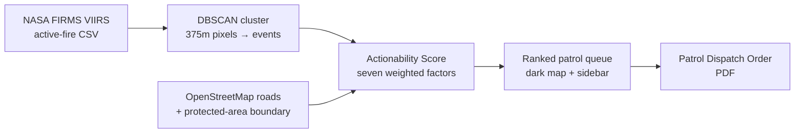

# Rangefinder

Deforestation alerting is a solved problem. Deciding which alert to drive to first is not — Rangefinder turns a firehose of satellite fire detections into a short, ranked, printable patrol order.


**Live demo: [https://rangefinder-cyan.vercel.app](https://rangefinder-cyan.vercel.app)**

Built for **Hack the Habitat** (theme: tech that protects the planet's ecosystems, climate and wildlife).

## The problem

A protected-area office does not lack data. It receives thousands of near-real-time satellite detections a week and can field one or two patrols a day. Today that choice gets made by eyeballing a heatmap — whichever cluster of dots looks biggest and closest wins the crew's time.

That method fails in a specific, predictable way: most alerts are unreachable, days old, too small to be worth the fuel, or sitting on land where the fire is perfectly legal. And the heatmap treats a 100-detection burn on unclassified frontier the same as a 2-detection burn inside a legally protected indigenous territory — visually, the second one barely registers. It should be the first phone call.

Rangefinder does not add more data. It ranks the data that already exists into something a ranger can act on and defend afterwards.

## Validation: are these fires actually on forest?

NASA FIRMS detects **heat**, not forest loss. During the Amazon burning season most fires
are on land that was already cleared — pasture maintenance, crop residue, re-burns — which
are routine and usually legal. A fire-based deforestation tool therefore owes you evidence
that its targets are on forest at all, rather than confidently ranking farm burns.

We checked. `scripts/validate_landcover.py` samples ESA WorldCover 10m (2021) in a ~1.1 km
box around every ranked target:

| | |
|---|---|
| Targets on ≥50% tree cover in 2021 | **10 of 10** |
| Mean tree cover across the top 10 | **91.7%** |
| Lowest individual target | 56.6% |

WorldCover predates these fires by five years, which is precisely the baseline that matters:
land already classified as cropland or grassland in 2021 cannot be undergoing deforestation
in 2026. Every current target sits on what was closed-canopy forest. The dense road grid
visible on the western side of the map is a **frontier pushing into forest**, not
established agriculture.

Reproduce it with `python scripts/validate_landcover.py`; the recorded run is in
`docs/landcover-validation.txt`.

**What this does and does not establish.** It shows the targets are on land that was forest
in 2021, which rules out the largest confound. It does not by itself prove clearing is
happening *now* — the land could in principle have been cleared between 2021 and 2025 and
be re-burning — and it does not distinguish a deforestation fire from an understory fire.
Closing those gaps means adding true canopy-loss alerts (GLAD/RADD), which is the top item
on the roadmap below.


## How it works



1. **Fetch** — `lib/sources/firms.ts` pulls the live NASA FIRMS VIIRS bulk regional CSVs for **three satellites** (NOAA-20, Suomi-NPP and NOAA-21; no API key required), clips them to the area, and merges them with spatio-temporal deduplication. Each platform crosses at a different local solar time, so a fire that starts and ends between one satellite's overpasses is invisible to it but plain in another's feed.
2. **Cluster** — `lib/cluster.ts` runs DBSCAN (1,500 m radius) over the raw detections. VIIRS reports one row per 375 m pixel, so a single clearing produces dozens of rows; clustering first is what turns a pixel dump into a list of distinct clearing *events*.
3. **Score** — `lib/score.ts` scores every event against roads and protected-area geometry and produces an explicit, inspectable **Actionability Score** (see below).
4. **Render** — the ranked queue drives a dark MapLibre GL map and a sidebar list (`app/page.tsx`, `components/MapView.tsx`), each entry showing its score breakdown and a plain-English rationale.
5. **Dispatch** — `/api/patrol-order` renders a real PDF (`lib/pdf/PatrolOrder.tsx`, `@react-pdf/renderer`) for the top-ranked targets: GPS in decimal and DMS, road-access and drive-time estimates, per-target justification, and field checkboxes to sign off on return.

If the live FIRMS fetch fails or returns nothing for the AOI, the app falls back to a cached snapshot and says so — the interface never silently shows stale data as current.

## The Actionability Score

Every factor is normalised to 0–1 and combined as a **weighted geometric mean**, not a weighted average. That choice matters: with a geometric mean, one disqualifying factor (a target no vehicle can reach) correctly collapses the score instead of being averaged away by the others. Each factor is floored just above zero so one missing input can't annihilate an otherwise urgent target outright.

It is deliberately not a machine-learning model — there is no labelled dataset of "patrols that were worth sending," so a learned model here would be unfalsifiable dressing. A ranger can argue with seven numbers; that matters more than a decimal place of accuracy.

| Factor | Weight | What it measures |
|---|---|---|
| **Extent** | 0.24 | How much forest is actually coming down. A blend of detection count (saturating at 30 detections/24h — beyond that the decision to go is unambiguous) and total fire radiative power, which breaks ties between equal-count clusters. |
| **Forest** | 0.20 | Was this forest to begin with. ESA WorldCover tree cover at the point, aged forward with Hansen annual loss. FIRMS reports heat, not forest loss, and in burning season most fires sit on land cleared years ago — without this factor the tool ranks pasture maintenance as urgent deforestation and looks entirely convincing doing it. Unknown scores 0.6, not zero: a gap in our baseline is not evidence against a target. |
| **Protection** | 0.18 | Whether the event falls inside a legally protected area, tested by ray-casting the coordinate against the real OpenStreetMap boundary polygon (not a distance approximation — see below). Inside scores 1.0; outside scores 0.35, not zero, because unclassified land still warrants a look. |
| **Recency** | 0.17 | Can the crew still catch them on site. Detections decay on a two-day half-life; past ~72 hours the visit becomes evidence collection rather than interdiction. |
| **Access** | 0.12 | Can a vehicle physically get there. Falls off hyperbolically with distance to the nearest mapped road — on a track scores 1.0, 1 km off scores 0.5, 5 km off scores 0.17 — with a 0.05 floor so remote mega-clearings still surface for an overflight rather than vanishing from the list. |
| **Confidence** | 0.06 | How much the detection itself is trusted — VIIRS's own low/nominal/high confidence flag, lifted slightly for night detections, which are both cleaner optically and likelier to be something somebody did not want observed. |
| **Proximity** | 0.03 | Fuel and hours from the ranger post. Deliberately the smallest weight: a small, close fire and a large, far one should not be conflated just because one is cheaper to reach. |

The weights and rationale live in `lib/score.ts`, alongside a rough one-way travel-time estimate (road speed for the driveable leg, walking pace for the final off-road approach) that also appears on the dispatch order.

## The Xingu finding

Running the pipeline against the two configured areas. These are a **dated
snapshot, not fixed values** — the feed is live and the counts climb through
the burning season, so a run today will differ:

| | Upper Xingu (Brazil) | Sebangau (Indonesia) |
|---|---|---|
| Detections in 24 h, three satellites merged | **1,047** | **3,697** |
| Distinct clearing events after clustering | **17** | **115** |
| OSM road segments behind the routing and access analysis | 8,067 | 45,489 |
| Road-graph nodes | 120,646 | 411,494 |
| Protected-area boundary | Parque Indígena do Xingu, 3,805 nodes | Taman Nasional Sebangau, 185 nodes |
| `/api/targets` response | ~4.5 s | ~11 s |

**Sebangau's top-ranked target is a fire inside Taman Nasional Sebangau** — 37
detections, 1,287 MW, on land that was 97% closed forest at baseline, 25 km by
road from the ranger post. In Upper Xingu the highest-ranked protected-land
target has just **two detections**: invisible on a heatmap, a named target with
a reason attached on the patrol queue.

That contrast — large legal fires outranked by small illegal ones — is the whole
argument for triage over visualisation. Every figure above is reproducible from
the live API; none is illustrative.

### Sentinel-2 NDVI — and why the headline figure was wrong

An earlier version of this README reported that NDVI at (-10.8, -54.0) fell from 0.4750 to
0.4082 — a delta of **-0.0669** — and called it vegetation loss. That was not a safe
inference, and the correction is worth reading.

The two scenes are 2025-09-29 and 2026-08-27: eleven months apart, in **different calendar
months**. Vegetation index moves seasonally on its own, so an unknown share of that drop
was simply the annual cycle rather than anything happening on the ground.

`scripts/ndvi_with_control.py` fixes this with a **spatial control** — undisturbed forest
19.8 km away (99.99% tree cover in WorldCover, zero FIRMS detections within 5.5 km),
sampled from the *same two images*, so it shares season, sun angle, sensor and atmosphere
by construction. Whatever the control moved is the seasonal baseline.

| | NDVI delta |
|---|---|
| Raw drop at target | −0.0667 |
| Undisturbed control, same scenes | −0.0477 |
| **Corrected (target − control)** | **−0.0190** |

**About 71% of the original figure was seasonality.** The corrected residual is still
negative and consistent with some genuine localised decline, but it is small — and it is
further confounded by roughly **20% smoke-like pixels in the after image**, which
Sentinel-2's SCL cloud mask does not flag (SCL is built for cloud, not smoke). Some or all
of the remaining −0.019 could be smoke attenuation rather than canopy loss.

Stated plainly: **this evidence does not support a claim of large-scale canopy loss at this
point.** It supports, at most, a modest and uncertain decline. The stronger evidence that
these targets are on forest is the WorldCover baseline above, not this NDVI figure.

### A wrong turn worth keeping in the record

An earlier draft approximated each protected area as a disc around its centroid — cheap to compute, and wrong in the worst possible direction. The Xingu centroid sits roughly 140 km from the AOI's largest fire cluster, so any disc radius wide enough to register a hit near the boundary would also have swept in that huge, entirely legal frontier burn and mislabelled it as illegal clearing inside indigenous land. That is precisely the failure mode a tool like this cannot afford: sending a patrol to raid the wrong site is worse than sending no patrol at all.

The fix was to stop approximating. `lib/geo.ts` now ray-casts each coordinate against the actual 3,805-node OSM boundary (`pointInRings`), and the true answer for this AOI is that the big fires are outside the park. A tool that is occasionally slow is a nuisance. A tool that is confidently wrong about legality is a liability — this is documented here because getting that distinction right, and admitting the near-miss, is more important than the geometry being clever.

## Working anywhere

Rangefinder is not a Brazil tool. Nothing about a place is compiled into the
code — an area of operations is a folder under `data/aoi/<slug>/`, discovered at
runtime, so the picker in the header lists whatever is on disk.

Adding a new one is a single command:

```bash
python scripts/setup_aoi.py     --slug kalimantan-sebangau     --label "Sebangau Peatlands"     --subtitle "Central Kalimantan, Indonesia"     --south -2.6 --west 113.4 --north -1.6 --east 114.4     --region southeast_asia
```

That fetches and builds everything the area needs from open sources — FIRMS
detections, the OSM road network (full resolution for routing, simplified for
the browser), protected-area boundaries stitched from OSM relations, the nearest
settlement as a ranger post, and an ESA WorldCover tree-cover baseline. Restart,
and the area appears in the picker. No code change.

Use `--dry-run` first to see exactly what it will fetch and write. Valid
`--region` values are the FIRMS regional feeds listed in `lib/sources/firms.ts`
(`south_america`, `southeast_asia`, `northern_and_central_africa`,
`southern_africa`, `south_asia`, `europe`, `russia_asia`, `global`).

Two caveats worth knowing. Routing and the forest grid are built over a box
padded by 0.5°, because the nearest town — and therefore the ranger post — is
usually outside the area itself; without the pad, routing fails for every
target. And the Sentinel-2 NDVI panel is per-area and optional: only areas with
an `ndvi.json` show it.

## Quickstart

```bash
npm install
npm run dev
```

Open `http://localhost:3000`. The app calls NASA FIRMS live by default; set `NEXT_PUBLIC_DEMO_MODE=true` to force cached fixtures (useful for a demo on unreliable conference wifi — no network call, no spinner).

## Project structure

```
app/
  page.tsx                  main UI: map + ranked patrol queue
  api/targets/route.ts      fetch → cluster → score → JSON
  api/patrol-order/route.ts renders the PDF dispatch order
  api/protected-areas/route.ts serves boundary geometry to the map
components/
  MapView.tsx                MapLibre GL dark map, targets + boundary + roads
lib/
  sources/firms.ts           NASA FIRMS CSV fetch + parse
  cluster.ts                 DBSCAN over raw detections
  score.ts                   the Actionability Score
  geo.ts                     haversine, point-to-segment, point-in-polygon
  config.ts                  AOI definition, attribution list, tunables
  types.ts                   shared types
  pdf/PatrolOrder.tsx         the dispatch-order PDF layout
data/
  alerts.json, roads.json, protected-areas.json, ranger-post.json, ndvi.json
  cached fixtures and demo-mode fallbacks
```

## Data sources

See `ATTRIBUTIONS.md` for full licence details. In short: NASA FIRMS (active fire), OpenStreetMap via Overpass (roads, protected-area boundary), Copernicus Sentinel-2 via Microsoft Planetary Computer (NDVI verification), CARTO dark-matter basemap tiles.

## Known limitations / what production would need

- **One ranger post per area, and it is a guess.** Areas themselves are data, not code — `scripts/setup_aoi.py` adds one without touching source — but each carries a single origin station, picked automatically as the nearest sizeable settlement in OSM. A real station is somewhere a person chose, there is usually more than one, and crews do not always start from the same place.
- **Roads and protected-area data are point-in-time OSM snapshots**, not a live feed — remote frontier roads are frequently missing or outdated in OSM, which directly understates access difficulty.
- **No persistence.** There are no accounts, no history of which orders were issued or which targets were actually visited, and no way to mark a target as actioned. Every load is a fresh score against the current 24h window.
- **No notifications or dispatch integration.** The PDF has to be generated and handed off manually; there is no SMS/radio alerting and no drone or vehicle tasking.
- **VIIRS thermal detections are not proof of clearing or of illegality** — a footer on every PDF says as much. Tenure, permit status, and ground truth still have to be verified by a human before enforcement action; the score is decision support, not a verdict.
- **Score weights are hand-set, not fitted.** They are defensible and documented, not derived from outcome data, because no such labelled dataset exists yet.
